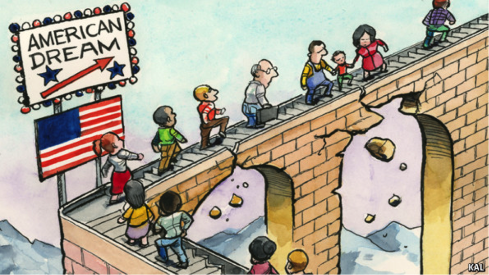

<!-- RMD File that gives a detailed synopsis of a Social Mobility Data analysis project
    for a Data Mining class at Sewanee: The University of the South. -->
    
```{r include=FALSE}
#Load Libraries
library(tidyverse)
library(readr)
library(dplyr)

#Allign Working Directories
getwd()
setwd("/Users/Calid/Documents/290Project")  
```
<br></br>   

### Introduction  
***
<body>
 <p>
 * Is individual success determined by salary levels? How about overall life satisfaction?
   Such determination is subject to opinion; however, for the sake of analyzing the idea 
   of life being fair, we will use income as a default detriment of success. 
 </p>
 
 <p>
 * The idea of success is the medium that we will use to explore social mobility. 
   An individual’s ability to be socially mobile-- by attaining higher social 
   status-- measures how fair life is. This idea, more precisely, is referred to
   as verticle mobility opposed to horizontal mobility and lateral mobility.     
 </p> 
 
 <p>
 * No matter an individual's socioeconomic location, the strength of fairness
   in the world is determined by the overall measure of everyone's ability to move
   up the social economic ladder.  
 </p>
</body>
<br></br>

```{r Verticle Mobility, echo=FALSE, fig.align='center', fig.cap="This picture depicts a  representation of verticle mobility that suggest people's process for reaching higher levels are different.", out.width='75%'}
knitr::include_graphics("ladderBallon.png")
```
<br></br> 

***
### Objective 
***
<body>
* Analyze the most influential socioeconomic factors that are associated with success.

* Explore influential socioeconomic factors and compare across group differences to find
  intersectional trends.  

* Determine if life is fair by measuring the strength of social mobility as it relates
  to specific socioeconomic factors.  
</body>
<br></br>

***
### Methods
***
<body>
 <p>
 Used data from the Bureau of Labor Statistics, which is a part of The U.S Department
 of labor. "The U.S. Department of Labor is the principal federal agency responsible 
 for measuring labor market activity, working conditions, and price changes in the
 economy." (BLS.com)       
 </p>
 
 <br></br>
<ul>
 <LI> Downloaded variables from two data sets: __"NLSY 1979"__ and __"NLSY79 Child and Young Adult"__   
 <UL>
  <LI> The NLSY 1979 data set provides a nationally representative sample of 12,000 adults
       who were between the ages of 14 and 22 years old when they were first surveyed in 1979. 
       This cohort continues to be interviewed every two years.  
       
  <LI> The NLSY 1979 Child and Young Adult cohort is a second group of respondents who are the
       biological children of mother's interviewed in the NLSY79 cohort. 
       
  <LI> The purpose of this survey design proves useful in tracking long term progress 
       of America's people.   
 </ul>
</ul>

</body>

```{r echo=TRUE, include=FALSE}
#Import data sets
NLSCYA <- read_csv("NLSCYArevised.csv")
NLSY79m <- read_csv("NLSY79mothers.csv")
ContextData <- read_csv("ContextChildren.csv")
```


```{r include=FALSE}
(NLSCYA) 
(NLSY79m)
(ContextData)
```
<br></br>    

#### Manipulating the Datasets
 <p>
 Filtering both data sets allows us to explore an intergenerational view of social 
 mobility after subtracting mothers out of the NLSY79 data set. Hereby, linking mothers
 to children as it provides an easily identifiable link between mothers and biological
 childen. 
 </p>

<ol>
<li>create two subpopulations: mothers and the children of these mothers with associated
    variables</li>
<li>filter each data set according to variableS of intrest for visual representation</li> 
</ol>  

```{r Mothers: Subduce Tables by Race, echo=TRUE}
#Filter mother data by race and replace all missing values in income columns with a special
#symbol to ignore such values when considering statistical summarization. 
#(1=Hispanic, 2= Black, 3= nonwhite/nonhispanic)
hispanicMoms    <-filter(NLSY79m, Race== 1) %>% mutate_all(~ replace( ., .<0, NA))
blackMoms       <-filter(NLSY79m, Race== 2) %>% mutate_all(~ replace( ., .<0, NA))
white_OtherMoms <-filter(NLSY79m, Race== 3) %>% mutate_all(~ replace( ., .<0, NA))
```

```{r include=FALSE}
# Get averages of mothers filtered by race
   summary(hispanicMoms)  
   summary(blackMoms)
   summary(white_OtherMoms)
```

```{r Children: Subduce Tables by Race, echo=TRUE}

#Filter children data by race and replace all missing values in income columns with a special 
#symbol to ignore such values when considering statistical summarization. 
#(1=Hispanic, 2= Black, 3= nonwhite/nonhispanic) 
hispanicChildren    <-filter(NLSCYA, raceChild== 1) %>% mutate_all(~ replace( ., .<0, NA))
blackChildren       <-filter(NLSCYA, raceChild== 2) %>% mutate_all(~ replace( ., .<0, NA))
white_OtherChildren <-filter(NLSCYA, raceChild== 3) %>% mutate_all(~ replace( ., .<0, NA))
```

```{r include=FALSE}
# Get averages of children filtered by race
   summary(hispanicChildren)  
   summary(blackChildren)
   summary(white_OtherChildren)
```
<br></br>  

***  
### Results  
***
##### Consumer Price Index (CPI)
<body>
 <p>
 Today, it is extrmely difficult to operate outside the confines of money, it seems like
 evrything cost which really stresses lower income families. Though, when 
 the cost of livng increases, everyones purchasing power goes down-- atleast in the short run. After
 six plus months to a couple of years, there are economic standards implemented to adjust
 for the rising cost of living. The question is who is affected most by inconsistencies
 and are they supported in times of need?    
 </p> 
 
```{r include=FALSE}
# Organize consumer price index averages. 

cpiTable <- tribble(
~Year, ~CPI,
#----|-----
1994, 148.20,
1995, 152.40,
1996, 156.9,
1997, 160.5,
1998, 163.00,
1999, 166.60,
2000, 172.20,
2001, 177.10,
2002, 179.90,
2003, 184.00,
2004, 188.90,
2005, 156.90,
2006, 201.60,
2007, 163.00,
2008, 215.30,
2009, 172.20,
2010, 177.10,
2011, 179.90,
2012, 184.00,
2013, 188.90,
2014, 195.30,
2015, 201.60,
2016, 240.01
)
``` 
<br></br> 
```{r echo=TRUE}
#Graph average CPI over years 1994'- 2016'
ggplot(data= cpiTable) + geom_line(mapping = aes(x = Year, y = CPI), colour= "red")+
                         theme_classic()+
                         scale_y_continuous(breaks = seq(100, 300, by = 20))+
                         labs(title= paste("Consumer Price Index (1994-2016)")
                         )
```
 <p>
  * CPI is often referred to as the cost of living. The average person's cost of 
    living takes into account the following expenses: 
    * Food and Beverages
    * Housing (rent of primary residence, fuel oil, befroom furniture)
    * Clothes (men's shirts and sweaters, women's dresses, jewelry)
    * Transportation (new vehicles, airline fares, gas, car insurance)
    * Medical Care (prescription drugs and medical supplies, physicians' services,
      hospital services)
    * Recreation (TVs, toys, pets and pet services, sports equipment, admissions)
    * Education and Communication (college tuition, postage, telephone services,
      computer software and accessories)
    * Other Goods and Services (tobacco and smoking products, haircuts and other 
      personal services, funeral expenses)  

  * Collective bargaining agreements although not always true
 </p>
</body>
<br></br>

##### Analyzing the Data: Generation 1
<body>
 <p>
  United States law implemented policy throughout history that deprieves underprivledged
  groups from opportunities that could pottentially raise their socioeconomic location.
 </p>
</body>

```{r Mothers: Transracial Tribble & Line Graph, echo=TRUE}

# Use summary means to organize average income data for Black children sample, Hispanic 
# children Sample, and the White/Other child serpent .
avgIncRace_Mothers <- tribble(
~year, ~hispanic, ~black, ~nonWhite_nonHispanic, 
#------|--------|---------|---------------------
1994, 12588, 11253, 14609,
1998, 16952, 15016, 17801,
2000, 19839, 18528, 21408, 
2004, 23395, 21256, 25387,
2008, 25848, 24596, 30307,
2010, 25863, 24452, 31105,
2012, 26888, 23122, 31925,
2014, 26685, 23442, 31533
)
```

```{r echo=TRUE}
#Long-term line graph ploting average expendables incomes for mothers across races.  
ggplot(data= avgIncRace_Mothers)+geom_line(mapping = aes(x = year, y = hispanic, colour="green"))+
                          geom_line(mapping = aes(x= year, y= nonWhite_nonHispanic, colour="red"))+
                          geom_line(mapping = aes(x = year, y = black, colour="blue"))+
                          geom_point(mapping = aes(x= year, y= hispanic, colour= "green"))+
                          geom_point(mapping = aes(x=year, y= black, colour= "blue"))+
                          geom_point(mapping = aes(x= year, y= nonWhite_nonHispanic, colour="red"))+
                          theme_classic()+
                          theme(legend.position="none")+                       
                          labs(title= paste("Mothers Transracial Progression")
                                                 ,x = "Long Term-Time (years)"
                                                 ,y = "Expendable Annual $")
```

<body> 
* 2004 - 2008: large amount of seperation 
* During hard times, in relation to the corresponding CPI during the recession, 
  white and other people experienced less detrimental effects than people of color. 
</body>
<br></br>   

##### Analyzing the data: Generation 2   
<body>
 <p>
  Having data from both the mother cohorts and their biological children provides an
  opportunity to examine data across generations. 
 </p>
</body>
```{r include=FALSE}
# Use summary means to organize average income statistics for the children
#(second generation) for Black sample, Hispanic Sample, and White and Other
avgIncRace_Children <- tribble(
~year, ~hispanic, ~black, ~nonWhite_nonHispanic, 
#------|--------|---------|---------------------
1994, 692.9, 636.8, 1060,
1998, 1299,  983.9, 1845,
2000, 5000,  5423,  5318, 
2004, 9100,  8421,  9593,
2008, 14805, 13060, 14812,
2010, 14589, 12381, 15322,
2012, 16774, 15435, 18652,
2014, 20566, 17630, 23817
)
```

```{r echo=TRUE}
# Long-term line graph of Childrens annual average expendable income compared by race.  
ggplot(data= avgIncRace_Children)+geom_line(mapping = aes(x = year, y = hispanic, colour= "green"))+
                          geom_line(mapping = aes(x= year, y= nonWhite_nonHispanic, colour= "red"))+
                          geom_line(mapping = aes(x = year, y = black, colour = "blue"))+
                          geom_point(mapping = aes(x= year, y= hispanic, colour= "green"))+
                          geom_point(mapping = aes(x=year, y= black, colour = "blue"))+
                          geom_point(mapping = aes(x= year, y= nonWhite_nonHispanic, colour= "red"))+
                          theme_classic()+
                          theme(legend.position="none")+                       
                          labs(title= paste("Children's Transracial Progression")
                                                 ,x = "Long Term-Time (years)"
                                                 ,y = "Expendable Annual $")
```
<body> 
* All children start off at similar points. 
    * Need statistics on how many people where how old at which points in the graph
* 2nd generation inherets the same pattern the first generation
</body>
<br></br>

***
### Cross-sectional Themes 
***
```{r American Dream, echo=FALSE, fig.align='center', fig.cap="A cartoon style critic of the American Dream", out.width='75%'}

```
<br></br>
<body>
* American Dream 
* Race In America 
*	Intergenerational Mobility 
* United States Economy 
</body>

***   
### Conclusion  
***
<body> 
 <p>
 Based on the data collected in this study, it can be concluded that vertical mobility is
 influenced by the socioeconomic location of individuals parents. Patterns in the data 
 identify a pattern of children following the same trajectory, as it relates to income 
 and socioeconomic class, as their parents. There is a clear disparity in these 
 trajectories based on the race of the individuals. White and non-black/ non-latino people
 tend to have higher levels of expendable income opposed to Hispanics and Blacks. 
 This disparity shows how racial demographics influence who is socially mobile. There are 
 more variables to analyze before declaring whether this racial disparity within verticle
 mobility is fair or not. 
 </p>
 
 <p>
 Moreover, this disparity can be linked to several environmental factors such as 
 education. Education is an influential socioeconomic factor that is often used 
 to predict individual success. In an extended study of social mobility, we can 
 use education attainment levels to explore if people across difference are 
 recieving the same amount of pay and higher carrer level positions that should
 return a higher social class. Evenmore, it would be beneficial to examine these 
 same variables with a particualr focus on one group, rather such group is 
 determined by geolocial location, class, race or gender etc. 
 </p>

 <p>
 Research shows that it is very hard for people in the lowest and highest socioeconomic
 classes to move up or down as it relates to vertical mobility. More research can look 
 further into a smaller range of groups to find interesting trends. Its difficult 
 and bad practice to analyze data from such a wide data set without exploring on a 
 more micro level first. After exploring on a micro level, data scientist can then 
 collaborate and compare for valuable information. 
 
 </p>
</body> 


***
### Acknowledgements 
***
<body>
* Dr. Lucia Dale x Sewanee: The University of the South
* Bureau of Labor Statistics
* Consumer News and Business Channel (CNBC)
<br><br>


<!-- > ggsave("290Project", plot = last_plot(), device = "png") -->


<!-- ###Unused Code -->
<!-- ###Unused Code -->
<!-- ###Unused Code -->
<!-- ###Unused Code -->
<!-- ###Unused Code -->
<!-- ###Unused Code -->
<!-- ###Unused Code -->
<!-- ###Unused Code -->
<!-- ###Unused Code -->
<!-- ###Unused Code -->
<!-- ###Unused Code -->
<!-- ###Unused Code -->
<!-- ###Unused Code -->
<!-- ###Unused Code -->
<!-- ###Unused Code -->
```{r Failed attempt to adjust Data For Inflation, eval=FALSE, include=FALSE}
# library(lubridate)
# library(dplyr)

# monthly_cpi <-
#   read_csv("NLSY79mothers.csv")
# monthly_cpi$cpi_year <- year("2016-03-26")
# yearly_cpi <- monthly_cpi %>% group_by(cpi_year) %>% summarize(cpi = mean(tIncome1994))
# yearly_cpi$adj_factor <- yearly_cpi$cpi/yearly_cpi$cpi[yearly_cpi$cpi_year == 2013]
```


```{r Educational/ Treatment Variables, eval=FALSE, message=FALSE, warning=FALSE, include=FALSE}

#Rename new variables 
#names(ContextData) <- c( "idChild", "birthYr", "hsDiploma", "asDegree", "boaDegree",
                         "bsDegree", "masterDegree", "doctoralDegree",
                         "professionalDegree", "lCourtesy", "lRespect","pService", 
                         "nSmart", "afraidOf", "dishonest", "aBetter", "isInsulted", 
                         "isThreatened_harrassed", "region_2014", "tHrsW_2014" 
                       )

#Link new contextual/ backgroup variables to the appropriate children
#withContext <- NLSCYA %>% inner_join(ContextData)
<!-- ``` -->


<!-- # ```{r who, eval=FALSE, message=FALSE, warning=FALSE, include=FALSE, paged.print=TRUE} -->
<!-- # filter(withContext, bsDegree> 0) -->
<!-- # tias<- data.frame(...) -->
<!-- # ``` -->


<!-- ```{r Intergenerational Connect, eval=FALSE, include=FALSE} -->
<!-- #Link Mothers To Children -->
<!-- d3 <- NLSY79m %>% inner_join(NLSCYA, by= c("NLSY79idCode" = "idMother")) -->
<!-- ``` -->


